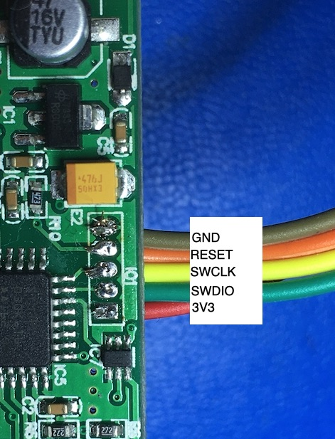
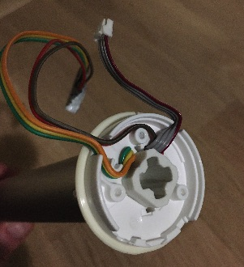
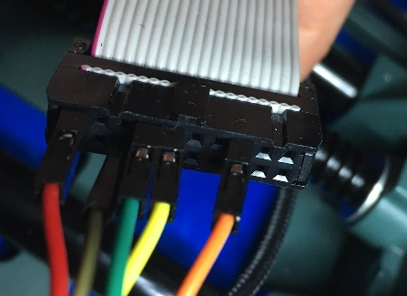

# IKEA Fyrtur roller blind motor unit custom firmware

## Introduction

This is a custom firmware for the TQL25-KT972 motor module (powered by the STM32F030K6T6 ARM microcontroller) used by IKEA Fyrtyr and Kadrilj roller blinds.


## IMPORTANT INFORMATION ABOUT CURRENT SENSING FUNCTIONALITY

TLDR; This should be safe BUT DON'T COME AFTER ME WITH A LAWYER IF YOUR HOUSE BURNS DOWN :)

Versions 0.82 (and earlier) have a predefined maximum motor current limit setting (1A default, configurable up to 2A).
This software limit can cause annoyances on some motor units which have higher static and/or dynamic friction than anticipated. This causes inconsistently high power draw and thus the firmware makes false assumption that the motor is stalled 
and the firmware then resets its known position to zero (upmost position) erroneously. When this position mismatch 
occurs it's a recipe for disaster because when the user (or most likely the home automation system as scheduled) 
tries to roll blinds down it causes movement further below the absolute lower limit, after which blinds start to move up 
but in reverse orientation.
This can create an annoying mess with wrinkled curtains and even damage the gluing between the curtains and the axel rod!

This false stall detection behaviour has sometimes occured even after blinds have started to rotate a bit and they should be 
free of static friction, so it's possible that abnormal current spikes might be detected by the current sensing circuitry 
also after initial movement.

The current limit feature in this firmware was designed to be an extra layer of safety in addition to the fuse on the custom (NOT ORIGINAL!) Fyrtur board. The main method of stall detection is via timeout of signals from the Hall sensors. 
This is also the way the original firmware works as far as I know. In my reverse engineering project of the original Ikea motor firmware I didn't find any evidence that the current sensing circuitry would be used for stall detection (take this with a grain of salt - it's possible that I have overlooked this part of the code). So it seems that even Ikea (or the 
subcontractor that manufactured the motor module) didn't bother to use the current sensing circuitry, possibly because
of these glitches.

This makes me conclude that in order to avoid annoying false stall detection and position mismatches it should be safe to 
disable the current sensing feature and to rely solely on the Hall sensor timeout (296 ms by default). After all, the current sensing is an extra feature not implemented originally by the manufacture. Needless to say, this kind of software feature, even if enabled, doesn't prevent from possible programming errors or physical catastrofic failures. This it's mandatory that other precautions are made to prevent too high current consumption in case of actual faulty operation.  Most (if not all) power adapters shut down the output if their maximum current draw is exceeded. The original Fyrtur board doesn't have any kind of fuse, but the Li-Ion battery modules are specified to have maximum 2A output. So I would like to assume that they have an internal current limiting / protection circuitry, BUT I HAVEN'T TESTED THEIR SAFETY WHEN SHORT CIRCUITED NOR DO I WANT TO!  

So, from version 0.83 and onwards the current sensing feature is disabled, but can be re-enabled if needed
via CMD_EXT_SET_MAX_MOTOR_CURRENT command.

# Features

The custom firmware mimics the functionality of the original firmware with following enhancements:
 * **Allow setting custom motor speed**: The full speed with original FW is a bit too noisy for my ears and this can be a problem especially when blinds are used in bedroom to control the amount of morning sunlight. Now it's possible to set the speed to 3 RPM and enjoy the (almost) silent operation, waking up to the sunlight instead of whirring noise :)
 * **Allow the use of "front roll" configuration** (curtain rod flipped 180 degrees) to give 2-3cm space between window and the blinds.
 * **Enable the use of 5-6 volt DC source:** Original firmware was intended to be used with chargeable battery which was protected from under-voltage by ceasing operation when voltage drops below 6 VDC. Our custom firmware instead is intended to be used with [ESP Fyrtur Wifi Module](https://github.com/mjuhanne/fyrtur-esp) (plugged to DC adapter) so the low voltage limit for motor operation is ignored, mitigating the need to shop for the harder-to-get 6-7.5 volt adapters. The minimum operating voltage check can be enabled though if one wants to use this with the original Zigbee module with battery.
 * **Smoother movement.** The blinds accelerate and decelerate more smoothly than with original FW
 * **More stable position handling.** Original firmware starts losing its position gradually if it isn't calibrated every now and then by rolling the blinds to up-most position. This custom firmware retains its position much better in the long run.
 * **Allow finer curtain position handling:** Original firmware has 1% granularity for the curtain position (0% - 100%). This translates to 1.5 cm resolution when using blinds with 1.5m tall window. It doesn't sound much, but when using sunlight-blocking curtain a lot of sunlight can seep between lower curtain and window board from a 0.5-1.5 cm gap. The custom firmware allows setting target position with sub-percent resolution so the curtain can be lowered more accurately.
* **OTA Firmware update** via UART

Although the new firmware can be used with original Ikea Fyrtur wireless (Zigbee) module, most of its additional features can only be utilized with [ESP8266/ESP32 based module using WiFi and MQTT connectivity](https://github.com/mjuhanne/fyrtur-esp)

## Wiring and UART interface

The motor is connected with 4 wires (TX, RX, GND, VCC). TX and RX are UART lines operating at 2400 kbps (8N1 = 1 start bit, 8 data bits,no parity, 1 stop bit) using 3.3V logic high. VCC is nominal 5.0-7.4 V.

### Installation

**Note that disassembling the motor unit will most definitely void your warranty!**

**Please first dump the original firmware (as described below) before proceeding to install custom FW!**

**This software is provided "as is". Use with caution and at your own risk! (See LICENSE file for DISCLAIMER)**

#### Software installation
For compiling the sources, install [STM32CubeIDE](https://www.st.com/en/development-tools/stm32cubeide.html) (I used version 1.4.2).  UPDATE: Currently I'm using Visual Studio Code and the "STM32 for VSCode" plugin.

Alternatively you can use binaries found in bin/ folder.

#### Disassembly
- Unscrew the 3 small screws on the plastic enclosure
- Carefully lift the small aluminum tabs holding the alumimum tube in its place
- (No need to disassemble the other side with the motor)
- Motor driver module can be now detached from the tube/motor side.

#### Debug/programming interface wiring

To flash the motor unit firmware a STM programmer is needed (recommended one is [ST-Link V2](https://www.digikey.com/en/products/detail/stmicroelectronics/ST-LINK-V2/2214535) which can be had for about 20 EUR / 22 USD). 
The programming mode that is used is Serial Wire Debug (SWD) instead of older JTAG standard. First solder 5 male Dupont wires to IO1 header as described below. The required wires are GND, RST, SWCLK, SWDIO, 3V3 (To help identifying the correct order, 3V3 is the square pin hole).



Then route the wires via holes in the the motor housing. You also need to carve a second narrow hole on the plastic end cap to fit the wires coming through (not shown in the picture). Be careful when reattaching the aluminum tube so that the little aluminum tabs are pushed firmly down in the plastic trenches and are absolutely flush with the rest of the tube (even slightest protusion can create annoying sound from friction and cause uneven movement!)



Attach SWD wires to the flat cable that came with the ST-Link.


#### Firmware dumping Windows ST-LINK utility and ST-Link V2:

- External power (>= 4.0V) is required via the motor 7.4V pin
- Launch STM32 ST-LINK Utility
- Edit Target->Settings: 
    Connection Settings: SWD, Frequency 480 Khz. Mode: Connect Under Reset, Debug in Low Power enable )
    Reset Mode: Hardware reset
- Connect to the target
- (if connecting fails, re-check wiring. If connection to ST-Link seems finicky, try upgrading the ST-Link firmware)
- Memory display: Address 0x08000000  with Size 0x8000 and Data width 32 bits (so total 32 KB flash size)
- You should see the firmware now displayed. Save it to a binary file and backup it.


#### (Custom) firmware installation with Windows ST-LINK utility and ST-Link V2:
 - proceed with steps described above
 - Click Target->Program & Verify
 - Select custom/original firmware file (.bin)
 - Make sure start address is 0x08000000
 - Skip Flash Erase and Skip Flash Protection verification can be set
 - Hit Start!

#### Linux / MacOS X ST-Link

There is also [Open Source ST-Link utility](https://github.com/stlink-org/stlink) available. It can be installed via HomeBrew on MacOS X (`brew install stlink`)

Probing:
```$ st-info --probe
Found 1 stlink programmers
 serial:     363f6b065250343857440343
 hla-serial: "\x36\x3f\x6b\x06\x52\x50\x34\x38\x57\x44\x03\x43"
 flash:      32768 (pagesize: 1024)
 sram:       4096
 chipid:     0x0444
 descr:      F0xx small
```

Reading:
```
$ st-flash read original-fyrtur-fw.bin 0x8000000 32768
st-flash 1.6.1
2020-11-15T14:19:51 INFO common.c: F0xx small: 4 KiB SRAM, 32 KiB flash in at least 1 KiB pages.
```

Writing: 
```
$ st-flash write Release/fyrtur-motor-board.bin 0x8000000
st-flash 1.6.1
2020-11-15T14:17:14 INFO common.c: F0xx small: 4 KiB SRAM, 32 KiB flash in at least 1 KiB pages.
file Release/fyrtur-motor-board.bin md5 checksum: 37264f7467389a6709a3f3bdea35977, stlink checksum: 0x00183980
2020-11-15T14:17:14 INFO common.c: Attempting to write 17768 (0x4568) bytes to stm32 address: 134217728 (0x8000000)
2020-11-15T14:17:14 INFO common.c: Flash page at addr: 0x08000000 erased
2020-11-15T14:17:14 INFO common.c: Flash page at addr: 0x08000400 erased
...
2020-11-15T14:17:14 INFO common.c: Flash page at addr: 0x08004400 erased
2020-11-15T14:17:14 INFO common.c: Finished erasing 18 pages of 1024 (0x400) bytes
2020-11-15T14:17:14 INFO common.c: Starting Flash write for VL/F0/F3/F1_XL core id
2020-11-15T14:17:14 INFO flash_loader.c: Successfully loaded flash loader in sram
 18/18 pages written
2020-11-15T14:17:15 INFO common.c: Starting verification of write complete
2020-11-15T14:17:15 INFO common.c: Flash written and verified! jolly good!
```

If writing fails with `ERROR common.c: stlink_flash_loader_run(0x8000000) failed! == -1` try power-cycling the motor board and/or retry flashing.

## OTA update

After first flashing the custom firmware with SWD interface the subsequent updates can be done vith ESP Wifi module (via UART interface) without ST-Link. Note that it is possible to brick the module if firmware upload is interrupted, so in any case it is recommended to solder wires to SWD header and route them outside the enclosure should you still need to manually flash the firmware in the future with the ST-Link.

## Motor board reverse engineering

*pcb-reverse-engineering/* folder contains very rough schematic of the motor board in PDF and KiCad project format. 

## UART interface command structure

All the commands described below are almost identical to the ones used with original firmware, and try to mimic their functionality as well as possible. In addition there are few custom commands that extend further the usability of the motor module.
Commands are sent to the motor module via UART line. They consist of 6 bytes and must follow this pattern:

`(0x00 0xff 0x9a) DATA1 DATA2 CHECKSUM`

The first 3 bytes are the header, DATA1 and DATA2 are the command/argument bytes and CHECKSUM is a bitwise XOR of the DATA1 and DATA2 bytes.

#### Normal commands

##### CMD_GO_TO
`00 ff 9a dd XX CHECKSUM`
- Moves curtain into position XX (between 0 and 100). 
- Checksum has to be calculated as described above.

##### CMD_UP
`00 ff 9a 0a dd d7`
- Starts rewinding the blinds up continously
- This continues until CMD_STOP is used or resistance is met / motor is stalling. (See Position chapter below). 

##### CMD_DOWN
`00 ff 9a 0a ee e4`
- Starts rolling the blinds down continously (until CMD_STOP is used or maximum curtain length is reached. See Position chapter below)

##### CMD_UP_17
`00 ff 9a 0a 0d 07`
- Rotates up the curtain rod 17 degrees (around 0.60cm). 
 - Note that in the original firmware this will cause a continous up movement (CMD_UP) if used when motor position is 0!
 - In custom firmware curtains will not rewind beyond the upper limit however.

##### CMD_DOWN_17
`00 ff 9a 0a 0e 04`
- Rotates down the curtain rod 17 degrees (around 0.60cm). It will not move beyond maximun curtain length however.

##### CMD_STOP
`00 ff 9a 0a cc c6`
- Stops the continous movement

##### CMD_STATUS
`00 ff 9a cc cc 00`
- Polls the motor module for status update.

The motor module response consists of 8 bytes and follows this pattern:

`0x00 0xff 0xd8 BATTERY_LEVEL VOLTAGE SPEED POSITION CHECKSUM`
- The first 3 bytes is the header
- BATTERY_LEVEL, VOLTAGE and POSITION are described below
- SPEED is motor speed in revolutions per minute (rpm)
- CHECKSUM is a bitwise XOR of the (BATTERY_LEVEL,VOLTAGE,SPEED,POSITION) bytes. 


**Example**: `00 ff d8 16 d8 19 32 e5`
- Header (0x00 0xff 0xd8)
- Battery level 0x16 (30%(?))
- Voltage around 7.0 Volts
- Speed 0x19=25 RPM (full speed)
- Curtain position 0x32=50
- Checksum 0xe5


#### Overriding move commands

These commands can move the curtains past the maximum (or full) curtain length (see Position chapter below)

##### CMD_UP_90
`00 ff 9a fa d1 2b`
- Rotates the curtain rod up by 90 degrees (around 3cm)

##### CMD_DOWN_90
`00 ff 9a fa d2 28`
- Rotates the curtain rod down by 90 degrees (around 3cm)

##### CMD_UP_6
`00 ff 9a fa d3 29`
- Rotates the curtain rod up by 6 degrees (around 0.22cm)

##### CMD_DOWN_6
`00 ff 9a fa d4 2e`
- Rotates the curtain rod down by 6 degrees (around 0.22cm)


#### Commands involving maximum curtain length
See Position chapter below for more information

##### CMD_SET_MAX_CURTAIN_LENGTH
`00 ff 9a fa ee 14`
- Sets the 'user defined' or 'logical' maximum curtain length (pos=100) to the current curtain position. This is intended to be used to limit curtain movement past installation restrictions (e.g. window board or alcove).

##### CMD_SET_FULL_CURTAIN_LENGTH
`00 ff 9a fa cc 36`
- Sets the 'full' or 'factory defined' maximum curtain length (pos=100) to current curtain position. This is supposed to be the absolute maximum curtain length restricted by the physical curtain length (movement past this limit would cause the curtain to rewind in opposite direction)
- Setting the full curtain length will set also the user defined (maximum) length to the same value.

##### CMD_RESET_CURTAIN_LENGTH
`00 ff 9a fa 00 fa`
- Reset the 'user defined' max curtain length back to the factory defined 'full' length. Motor also loses its current position and calibration procedure must be done (see 'Position Calibration' chapter below)


#### Commands involving curtain rod orientation

##### CMD_TOGGLE_ORIENTATION 
`00 ff 9a d6 00 d6`
- Toggles between standard (back roll) and reversed (front roll) configuration. Reversing the orientation changes motor and sensor direction and flips location/position (e.g. from 20% to 80%). Setting will be written to EEPROM/FLASH.

##### CMD_RESET_ORIENTATION 
`00 ff 9a d5 00 d5`
- Reset the orientation back to standard (back roll) if current orientation is front roll. Setting will be written to EEPROM/FLASH if changed. Nothing is done if configuration is already at back roll.


#### Custom firmware commands

##### CMD_EXT_GO_TO
`00 ff 9a 1X YZ CHECKSUM`
- "Go to position" command with finer resolution (position is given between 0.0 and 100.0). 
- Target position is given with XY.Z (lower 4 bits of the 1st byte + 2nd byte  = 12 bits total) where XY is the decimal part and Z is the fractional part.
  - POS = (X*256 + YZ) / 16
- Checksum has to be calculated as with CMD_GO_TO.

##### CMD_EXT_OVERRIDE_DOWN
`00 ff 9a fa da 20`
- Starts rolling the blinds down 5 turns or until CMD_STOP is called. This command will not respect max/full curtain length and can be used for example to fine-tune lower curtain length in conjunction by setting slower speed beforehands. The 5 turn limit here is just for safety.

##### CMD_EXT_SET_SPEED
`00 ff 9a 20 XX CHECKSUM`
- Set the motor speed to XX (in RPM). Normal values are between 1 and 25 RPM.In contrast to CMD_SET_DEFAULT SPEED, this will not be written to non-volatile memory which has limited write cycles. 
This means that this command can be used to change motor speed real time without a fear of deteriorating flash memory.

##### CMD_EXT_SET_DEFAULT_SPEED
`00 ff 9a 30 XX CHECKSUM`
- Set the default motor speed to XX (in RPM). Normal values are between 1 and 25 RPM. In contrast to CMD_SET_SPEED, this will be written to non-volatile memory. 

##### CMD_EXT_SET_MINIMUM_VOLTAGE
`00 ff 9a 40 XX CHECKSUM`
- Set the minimum operating voltage to XX. This can be used to protect the battery from under voltage condition. If operating voltage is below this setting, UART interface will function normally but motor will not engage. 
- Minimum voltage = XX/16
- XX : 0x00 (Bypass voltage check. Default setting)

##### CMD_EXT_SET_AUTO_CAL
`00 ff 9a 60 XX CHECKSUM`
- Automatically calibrate the curtain position at power-on (see Calibration chapter below)
- Enabled = 0x01 (default setting), 0x00 (disabled)

##### CMD_EXT_SET_ORIENTATION (deprecated, will be soon removed. Use CMD_TOGGLE_ORIENTATION or CMD_RESET_ORIENTATION instead
`00 ff 9a 61 XX CHECKSUM`
- Sets the curtain rod orientation. Reversing the orientation changes motor and sensor direction.
- Normal/"back roll" = 0 (default setting), 1 = reversed/"front roll"

##### CMD_EXT_GET_VERSION
`00 ff 9a cc dc 10`
- Get firmware version

The motor module response consists of 8 bytes and follows this pattern:

`0x00 0xff 0xd0 VERSION_MAJOR VERSION_MINOR MINIMUM_VOLTAGE CHECKSUM`
 - The First 3 bytes is the header
 - VERSION_MAJOR and VERSION_MINOR describe the firmware version (e.g. 0.7)
 - MINIMUM_VOLTAGE is the minimum operating voltage (see CMD_SET_MINIMUM_VOLTAGE)
 - CHECKSUM is a bitwise XOR of the (VERSION_MAJOR,VERSION_MINOR,MINIMUM_VOLTAGE) bytes.

##### CMD_EXT_GET_STATUS
`00 ff 9a cc de 12`
- Get extended status bytes.

The motor module response consists of 8 bytes and follows this pattern:

`0x00 0xff 0xda MODULE_STATUS MOTOR_CURRENT POSITION_DEC POSITION_FRAC CHECKSUM`
 - The First 3 bytes is the header
 - MODULE_STATUS (0=Stopped, 1=Moving, 2=Error)
 - MOTOR_CURRENT (in mA).
 - POSITION_DEC and POSITION_FRAC report the curtain position with higher resolution
  - POS = POSITION_DEC + POSITION_FRAC/256).
 - CHECKSUM is a bitwise XOR of the (MODULE_STATUS,MOTOR_CURRENT,POSITION_DEC,POSITION_FRAC) bytes.

##### CMD_EXT_GET_LIMITS
`00 ff 9a cc df 13`
- Get full/maximum curtain lengths and calibrating byte

The motor module response consists of 8 bytes and follows this pattern:

`0x00 0xff 0xbb CALIBRATING MCL_1 MCL_2 FCL_1 FCL_2 CHECKSUM`
- The first 3 bytes is the header
- CALIBRATING (0=Normal operation, 1=In calibration mode. Movement is uninhibited by any limits set by curtain lengths and position is always reported as 50. See Position calibration chapter below)
- MCL = Maximum Curtain Length = MCL_1 * 256 + MCL_2
- FCL = Full Curtain Length = FCL_1 * 256 + FCL_2
- CHECKSUM is a bitwise XOR of the (CALIBRATING,MCL_1,MCL_2,FCL_1,FCL_2) bytes. 

##### CMD_EXT_ENTER_BOOTLOADER
`00 ff 9a ff 00 ff`
- Enter the STM32 bootloader and get ready for firmware update. In order to exit the bootloader one needs to use special 'Go' bootloader command (used by ESP32 after firmware update), do hardware reset (impossible with UART interface) or do a power-cycle.

##### CMD_EXT_SET_MAX_MOTOR_CURRENT
`00 ff 9a 62 XX CHECKSUM`
- Sets the maximum motor current to XX. Warning! This can cause glitches (see the section about current sensing functionality above). Disabled by default.
- Maximum current (mA) = XX * 8
- XX : 0x00 (Disable current sensing. Default setting)


## Curtain position and curtain length

Normally the motor unit reports the curtain position (after CMD_GET_STATUS command) as percentage of maximum operating distance or curtain length (0 for upper limit and 100 for lower limit).
If more accurate positioning is needed, use CMD_EXT_GET_STATUS command for sub-percent resolution.

When lowering the curtain the motor automatically stops when either the maximum (user defined) or full (factory defined) curtain length has been reached. The default value for factory setting is 13 turns + 265 degrees.

Curtain can be raised above the top limit or lowered below the lower limit with overriding move commands. In these cases the motor module will keep track of its position with internal counters. 
It will however NOT announce the position in STATUS message, but instead the position is truncated between 0 and 100.

## Configuring the curtain length

The maximum and full curtain lengths can be changed by using CMD_SET_MAX_CURTAIN_LENGTH / CMD_SET_FULL_CURTAIN_LENGTH commands. These will set the current curtain position to 100 and will restrict normal movements below this lower limit. Reported curtain position data is now scaled accordingly.

Maximum (user-defined) curtain length can be reset to full ('factory defined') length via CMD_RESET_CURTAIN_LENGTH command. This will also start the calibration procedure, which causes motor to ignore the current curtain position and allow uninhibited movement regardless of the user/factory defined curtain lengths.
Position will be reported as 50 regardless of motor movement until calibration procedure is complete (see Position calibration chapter below). Position is then reset to 0 and normal operation can continue as described above.

Difference between maximum (or 'user-defined') and full (factory-set) curtain lengths is that the maximum curtain length is intended to be used to limit curtain movement past installation restrictions (e.g. window board or alcove), whereas full (factory defined) is supposed to be the absolute maximum curtain length restricted by the actual physical curtain length (movement past this limit would cause the curtain to rewind in opposite direction).
The default full curtain length is measured in curtain rod rotations and has value of 13 turns + 265 degrees.

The user-defined curtain length can be set only between 0 and full length, whereas the full (factory-set) is unrestricted in this way. It is assumed that the full curtain length is programmed by manufacturer (or a distributor, such as Ikea in this case) to match the curtain length of the end product.
Changing the full curtain length will also reset the user-defined length to the same value.
In original firmware, the full curtain length setting is stored into EEPROM/FLASH. In addition to this, our custom firmware saves also the user-defined max length to non-volatile memory.
Since the full curtain length cannot be set to or restored to any default value via UART command in the original firmware, the only way to extend this limit further is to use overriding movement commands to lower the curtain to the desired position and then call CMD_SET_FULL_CURTAIN_LENGTH again. In our custom firmware, it's also possible set the full length value programmatically by using CMD_SET_LOCATION followed by CMD_SET_FULL_CURTAIN_LENGTH. With CMD_EXT_OVERRIDE_DOWN command the user can also roll smoothly below the lower limit. 

## Position calibration

When the module is first powered up the curtain position is uncalibrated (position is set to full length). If auto-calibration is enabled (the default setting) the calibration is done automatically by rewinding the curtain upwards. During this time position byte stands at 50 (sometimes at 100 in the original firmware). Rewinding continues until sufficient resistance occurs and motor begins stalling. Now it is assumed that the curtain has been lifted to upmost position and position is now reset to 0. This position calibration is done also every time the curtain is rolled up until motor stalls, as well as after the CMD_RESET_CURTAIN_LENGTH command (although in the latter case the movement itself has to be started by a separate command).

Auto-calibration can be configured with CMD_EXT_SET_AUTO_CAL.

## Curtain position calibration in a nutshell

- To set maximum curtain length, lower the curtain to suitable position and call CMD_SET_MAX_CURTAIN_LENGTH. Position is now reset to 100 and scaled accordingly when curtain is rewinded to other lengths
- To adjust maximum curtain length, move to suitable position and call CMD_SET_MAX_CURTAIN_LENGTH again. If this desirable position is beyond the current maximum curtain length, we have to use the "Overriding" movement commands to roll the curtains past the current limit.
- To reset the maximum curtain length to full length, use CMD_RESET_CURTAIN_LENGTH command and do the calibration procedure (roll up the curtain to upper hard stop until motor stalls). Now position is reset to 0. 
- To adjust the full curtain length (factory setting), navigate to desired position with "Overriding" movement commands and call CMD_SET_FULL_CURTAIN_LENGTH. This will reset also the maximum (user defined) curtain length to the same value.


## Changing the curtain rod orientation

If you want to install the curtain rod backwards (a.k.a. "front roll") instead of the normal configuration ("back roll"), you can use CMD_EXT_SET_ORIENTATION command with "1" as parameter. The steps for doing this is to first roll up the blinds, then switch orientation with the command, followed by powering off and the actual physical flipping of the curtain rod.
The order is important because normally auto calibration starts rolling blinds up after power on, but if the rod is reversed first, then the blinds start rolling in opposite direcion (i.e. down) without any limits..

## Battery and Voltage bytes

Battery level: (0x00=empty, >0x45 = full)
Voltage follows roughly the formula: V = (voltage byte) / 31.

Below are the results of battery and voltage bytes from original firmware, experimented with external DC voltage source using various voltage levels (did not want to go above 7.5..)
```
volt 3.7: 0x00 0x7c 
volt 4.5: 0x00 0x89
...
volt 4.7: 0x00 0x90 
volt 5.0: 0x00 0x99
volt 5.5: 0x00 0xa9
volt 5.6: 0x00 0xac 
..
volt 6.0: 0x00 0xb8 
volt 6.4: 0x00 0xc5 
volt 6.5: 0x01 0xc8 
volt 6.8: 0x08 0xd2 
volt 7.0: 0x12 0xd8
volt 7.1: 0x20 0xdb
volt 7.2: 0x2e 0xde
volt 7.3: 0x38 0xe1
volt 7.4: 0x40 0xe4
volt 7.5: 0x45 0xe7 
```

With original firmware, the motor operates with voltages such as 6.0-6.4 volts even though battery is reported to be empty.
Below 6V the motor itself would not engage, but the motor module still responds to status queries until around 3.7V is reached.

Our custom firmware reports the voltage correctly, but battery byte for now is fixed 0x12 (matching 7.0V)


